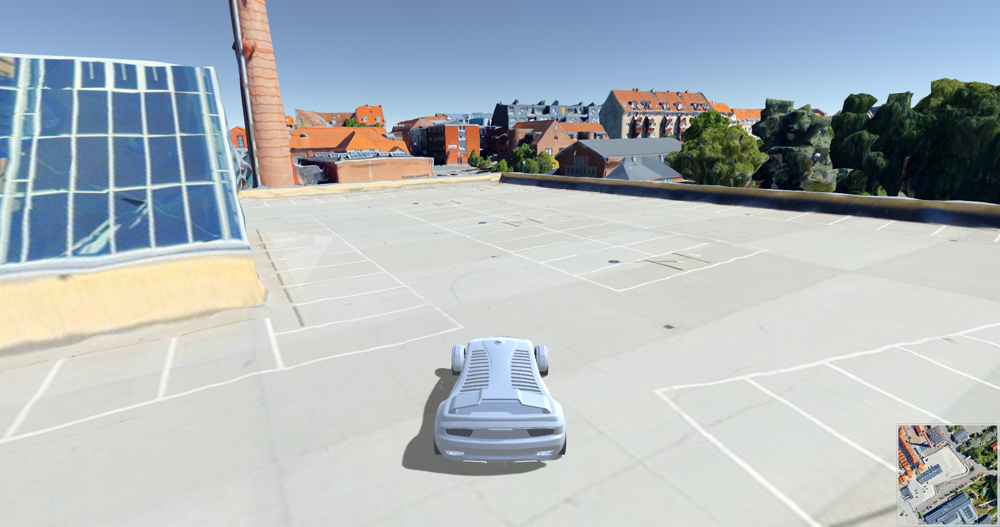
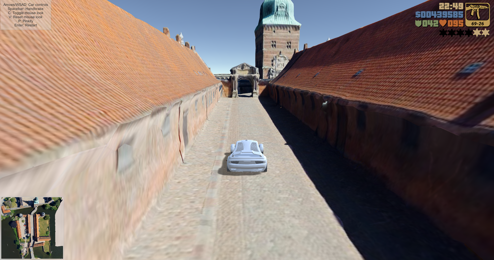

# VTS Browser Integration Plugin For Unity 3D Game Engine

[VTS Browser CPP](https://github.com/melown/vts-browser-cpp) is a collection of libraries that bring VTS client capabilities to your native applications.

[This Unity Plugin](https://github.com/Melown/vts-browser-unity-plugin) integrates the VTS Browser into the popular Unity 3D game engine.

## Example Screenshots

## Features

- The plugin handles data streaming and resource management
- Rendering is done in Unity (with custom shaders)
  - This allows you to customize the rendering process
  - Provided shaders:
    - Unlit
    - Unlit with shadows
    - Optionally with custom atmosphere that works with whole-planet views and transitions to street-level views
- Supports multiple cameras
- Support for physical collision

## Documentation

The Unity Plugin documentation is at the
[wiki](https://github.com/Melown/vts-browser-unity-plugin/wiki).

Browser documentation is available at its own
[wiki](https://github.com/melown/vts-browser-cpp/wiki).

Documentation for the whole VTS is at
[Read the Docs](https://melown.readthedocs.io).

## Building

Build instructions are the same as for the [VTS Browser Build Wrapper](https://github.com/Melown/vts-browser-cpp-build-wrapper/blob/master/README.md).
Just start in the root folder of this repository to ensure that the settings from CMakeLists.txt here are applied too.

## Using the plugin In Unity

Unity 2018 or newer is required.

The simplest way is to create a few symbolic/directory links on the filesystem for each Unity project.

In all cases, make sure to configure the plugins in the Unity Inspector to only include them on the relevant platforms.

### On Windows

 - \<Unity Project\>/Assets/Vts -\> \<This Repository\>/src/Vts
 - \<Unity Project\>/Assets/Vts/Plugins/vts-browser.dll -\> \<This Repository\>/build/result/relwithdebinfo/vts-browser.dll

### On Mac

 - \<Unity Project\>/Assets/Vts -\> \<This Repository\>/src/Vts
 - \<Unity Project\>/Assets/Vts/Plugins/vts-browser.bundle -\> \<This Repository\>/build/result/relwithdebinfo/vts-browser.bundle

### For iOS

 - \<Unity Project\>/Assets/Vts -\> \<This Repository\>/src/Vts
 - \<Unity Project\>/Assets/Vts/Plugins/vts-browser.framework -\> \<This Repository\>/build-ios/result/relwithdebinfo/vts-browser.framework
 - After you make the build in Unity, open the XCode project:
   - in the project, Build Settings, Linking, set _Runpath Search Paths_ to _@executable_path_ and _@executable_path/Frameworks_
   - in Build Phases, Copy Files, add vts-browser.framework to Destination Frameworks
     - make sure that _Code Sign On Copy_ is on

### For Linux

 - Build the vts-browser library on linux and copy it to \<Unity Project\>/Assets/Vts/Plugins/libvts-browser.so

## Bug Reports

For bug reports or enhancement suggestions use the
[Issue tracker](https://github.com/melown/vts-browser-unity-plugin/issues).

## How to Contribute

Check the [CONTRIBUTING.md](https://github.com/Melown/vts-browser-cpp/blob/master/CONTRIBUTING.md) on the VTS Browser CPP repository.
It applies equally here.

## License

See the [LICENSE](LICENSE) file.

