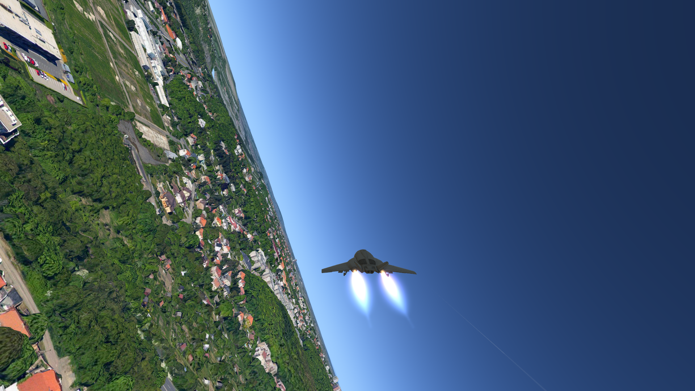
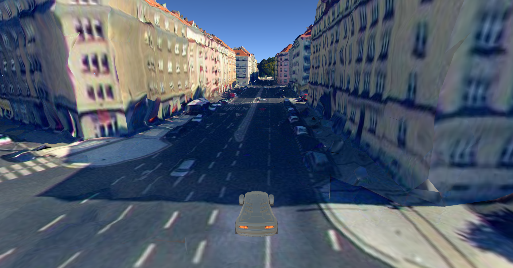

# VTS Browser Integration Plugin For Unity 3D Game Engine

[VTS Browser CPP](https://github.com/melown/vts-browser-cpp) is a collection of libraries that bring VTS client capabilities to your native applications.

[This Unity Plugin](https://github.com/Melown/vts-browser-unity-plugin) integrates the VTS Browser into the popular Unity 3D game engine.

## Example Screenshots

View of the whole Earth.

Jet flight, made with Unity Standard Vehicles Assets.

Driving a car in a city, made with Unity Standard Vehicles Assets.

## Features

- The plugin handles data streaming and resource management
- Rendering is done in Unity (with custom shaders)
  - This allows full customization of the rendering process
- Support for collisions

## Documentation

The Unity Plugin documentation is at the
[wiki](https://github.com/Melown/vts-browser-unity-plugin/wiki).

Browser documentation is available at its own
[wiki](https://github.com/melown/vts-browser-cpp/wiki).

Documentation for the whole VTS is at
[Read the Docs](https://melown.readthedocs.io).

## Building

Build instructions are the same as for the [VTS Browser Build Wrapper](https://github.com/Melown/vts-browser-cpp-build-wrapper/blob/master/README.md).
Just start in the root folder of this repository to ensure that the settings from CMakeLists.txt here are applied too.

## Accessing the Plugin In Unity

Unity 5 or newer is required.

The simplest way is to create a few symbolic/directory links on the filesystem for each Unity project.

### On Windows

 - \<Unity Project\>/Assets/vts -\> \<This Repository\>/src/vts
 - \<Unity Project\>/Assets/Plugins/vts -\> \<This Repository\>/build/bin/relwithdebinfo

### On Mac

 - \<Unity Project\>/Assets/vts -\> \<This Repository\>/src/vts
 - \<Unity Project\>/Assets/Plugins/vts-browser.bundle -\> \<This Repository\>/build/lib/relwithdebinfo/vts-browser.framework
   - Note that the framework is _renamed_ to bundle.

## Bug Reports

For bug reports or enhancement suggestions use the
[Issue tracker](https://github.com/melown/vts-browser-unity-plugin/issues).

## How to Contribute

Check the [CONTRIBUTING.md](https://github.com/Melown/vts-browser-cpp/blob/master/CONTRIBUTING.md) on the VTS Browser CPP repository.
It applies equally here.

## License

See the [LICENSE](LICENSE) file.

